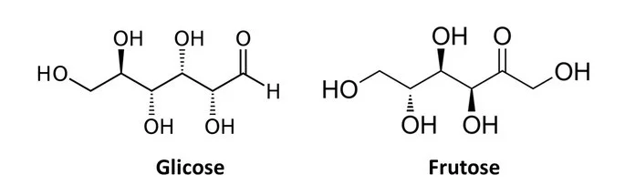
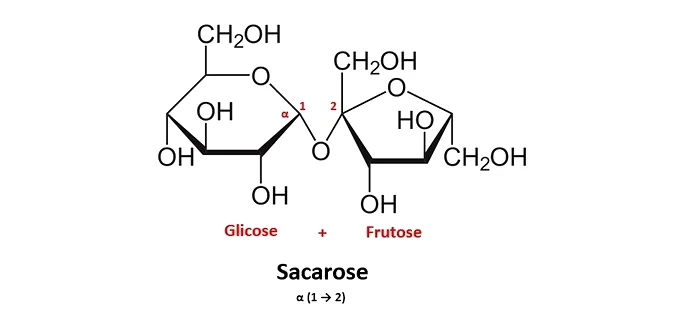
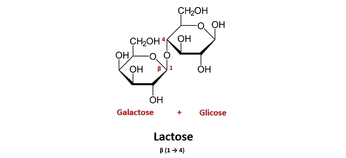
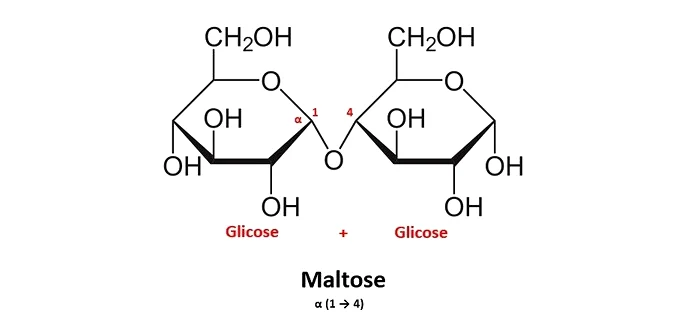
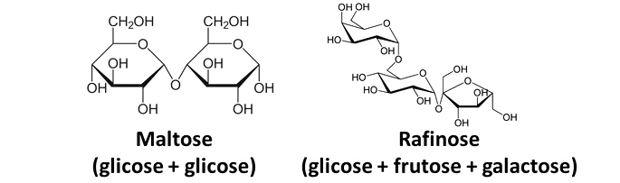

Os carboidratos são moléculas formadas por carbono, hidrogênio e
oxigênio, e que têm a função de fornecer energia para manter as funções
vitais do organismo, como respiração e batimentos do coração, e para
atividades do dia a dia, como trabalhar e fazer exercícios.

Os carboidratos são as principais fontes de energia de uma célula, além
de fazerem parte da composição de ácidos nucleicos e da parede celular.
Chamados também de glicídios, hidratos de carbono e açúcares, essas
substâncias são encontradas geralmente em alimentos de origem vegetal,
como batatas e feijão, e apresentam em sua composição o carbono,
hidrogênio e oxigênio. Podemos classificar os glicídios em três grupos,
utilizando como critério seu tamanho e organização, são eles:
monossacarídeos, dissacarídeos e polissacarídeos.

O que são Carboidratos

Os carboidratos são biomoléculas de grande importância biológica e
formam a classe de biomoléculas mais abundantes do nosso planeta. Essas
moléculas são formadas fundamentalmente por carbono, hidrogênio e
oxigênio, daí a denominação de hidratos de carbono. Vale salientar, no
entanto, que outros átomos podem estar presentes em suas moléculas, como
é o caso do nitrogênio encontrado na quitina, que forma o exoesqueleto
de artrópodes.

Função dos carboidratos

1\. Fornecimento de energia

Os seres humanos obtêm energia através da alimentação. Quando ingerido,
o carboidrato é decomposto por enzimas específicas em unidades menores
de açúcares até que se produza a glicose.

Nas células, a energia é obtida a partir da glicose, conforme a equação
global a seguir.

$$\ce{C6H12O6} + 6 \ce{O2} \ce{->} 6 \ce{CO2} + 6 \ce{H2O} + energia$$

Essa energia liberada é utilizada, por exemplo, pelo sistema nervoso,
sendo o cérebro o principal consumidor. A energia dos neurônios é
proveniente quase que exclusivamente da glicose.

2\. Armazenamento energético

Plantas possuem um pigmento verde chamado de clorofila, que é capaz de
absorver a energia luminosa proveniente do Sol.

Utilizando o gás carbônico do ar e a água captada pelas raízes, as
plantas são capazes de converter energia solar em energia química no
processo de fotossíntese.

A fotossíntese ocorre segundo a reação química a seguir.

$$6 \ce{CO2} + 6 \ce{H2O} + luz solar \ce{->} \ce{C6H12O6} + 6 \ce{O2}$$

As moléculas de glicose (C6H12O6) produzidas combinam-se e formam o
amido, polissacarídeo responsável pelo armazenamento energético em
órgãos vegetais.

3\. Estruturação celular

A célula vegetal é a unidade formadora do tecido das plantas, sendo
constituída de organelas e material genético, delimitados por uma parede
celular.

O principal componente da parede celular é a celulose, um polissacarídeo
composto por inúmeras moléculas de glicose.

A celulose faz com que as células dos vegetais possuam uma estrutura
fixa, que é responsável pela proteção, sustentação e resistência. Esse
carboidrato também regula o acesso de água na célula e a interação entre
células vizinhas.

Ao falar em carboidratos, muitas pessoas lembram-se apenas de alimentos,
como pães, bolos, macarrão e doces. Entretanto, esses alimentos não são
os únicos que contêm essas biomoléculas. Como sabemos, os vegetais
realizam fotossíntese e armazenam carboidratos ao final desse processo
como fonte de energia para a planta. Sendo assim, todos os alimentos de
origem vegetal apresentam carboidratos, incluindo-se as frutas.
Alimentos derivados do leite e o mel também possuem carboidratos.

Classificação dos carboidratos

Os carboidratos podem ser classificados em três classes principais,
utilizando como critério o tamanho de sua cadeia de carbono:
monossacarídeos, dissacarídeos e polissacarídeos.

Monossacarídeos

Os carboidratos mais simples são os chamados monossacarídeos, os quais
são monômeros (unidades que formam os polímeros) que formam os
carboidratos mais complexos. Os monossacarídeos, também chamados de
açúcares simples, são classificados de acordo com o número de carbonos
que possuem em sua molécula, que apresenta fórmula geral . Temos, então,
as trioses com três, as tetroses com quatro, as pentoses com cinco, as
hexoses com seis e as heptoses com sete átomos de carbono.

Como exemplo de monossacarídeo devemos destacar duas pentoses que
participam da formação do DNA e RNA: a desoxirribose e a ribose,
respectivamente. Além disso, temos a glicose e a frutose, duas hexoses
extremamente importantes para os seres vivos. É importante salientar que
a glicose, que apresenta fórmula , é o principal carboidrato utilizado
pelas células para a obtenção de energia.\"

Dissacarídeos

Os dissacarídeos são carboidratos formados por duas moléculas de
monossacarídeos, ligadas por ligações glicosídicas, e são solúveis em
água. Entre os principais exemplos, podemos citar a sacarose, que é
resultado de uma molécula de glicose com uma de frutose. Além da
sacarose, temos a lactose (glicose + galactose) e maltose (glicose +
glicose).

Uma característica importante dos dissacarídeos é que eles precisam ser
quebrados para sua utilização como fonte de energia, diferentemente dos
monossacarídeos.

Oligossacarídeos

Os oligossacarídeos correspondem aos carboidratos solúveis formados por
mais de um monossacarídeo unidos por ligações O-glicosídicas.

Fazem parte desse grupo os dissacarídeos, junção de dois
monossacarídeos, e os trissacarídeos, que correspondem à união de três
monossacarídeos em uma molécula.

A maltose é um dissacarídeo que faz parte do malte utilizado na produção
de cerveja. A rafinose é um trissacarídeo encontrado em alimentos, como
o feijão.

Polissacarídeos

Os polissacarídeos são formados pela junção de centenas e até milhares
de monossacarídeos. Diferentemente dos dissacarídeos, não são solúveis
em água. Essa insolubilidade é importante para diversos organismos, como
os artrópodes, por exemplo, que possuem um exoesqueleto formado por um
polissacarídeo (quitina) que os protege contra a dissecação. Além da
quitina, podemos citar como exemplos de polissacarídeos:

Celulose: Componente principal da parede celular das células vegetais. É
considerado o carboidrato mais abundante na natureza. Apesar de não ser
digerida pelos seres humanos, a celulose é importante na dieta como
fibra. Amido: Principal reserva de energia dos vegetais. É formado por
moléculas de glicose ligadas entre si.

Glicogênio: Carboidrato de reserva encontrado em animais. O glicogênio
está armazenado no fígado e músculos e, quando o corpo necessita de
energia, ele é quebrado em moléculas de glicose. Assim como o amido e a
celulose, o glicogênio é resultado da união de várias moléculas de
glicose. Os polissacarídeos, quando formados por apenas um tipo de
monossacarídeo, recebem o nome de homopolissacarídeos, sendo esse o caso
do amido e do glicogênio. Quando os polissacarídeos apresentam dois ou
mais monossacarídeos diferentes, recebem a denominação de
heteropolissacarídeo. Como exemplo de heteropolissacarídeo, podemos
citar o peptidoglicano, que forma a parede celular das bactérias.\"

Tipos de carboidratos

Os carboidratos podem ser classificados de acordo com a sua complexidade
em simples e complexos.

1\. Carboidratos simples

Os carboidratos simples são moléculas simples que formam estruturas
maiores e carboidratos complexos, como glicose, ribose, xilose,
galactose e frutose.

Quando se ingere uma porção de carboidrato, como pão ou fruta, por
exemplo, ele se decompõe no sistema gastrointestinal, chegando ao
intestino na forma de monossacarídeos para ser absorvido.

A união de duas unidades monossacarídicas forma dissacarídeos, como a
sacarose ou açúcar de mesa (glicose + frutose), a lactose (galactose +
glicose) e a maltose (glicose + glicose).

Já a união de 3 a 10 unidades de monossacarídeos dá origem aos
oligossacarídeos, que são moléculas com ação probiótica como os
frutooligossacarídeos (FOS) e os galactooligossacarídeos (GOS).

Por serem mais facilmente digeridos e absorvidos pelo organismo, os
carboidratos fazem com que o açúcar no sangue suba rapidamente, ou seja,
têm alto índice glicêmico. Além disso, esse tipo de carboidrato também
aumenta a sensação de fome e, quando consumido em excesso, favorece o
acúmulo de gordura corporal e o ganho de peso. Veja mais sobre o índice
glicêmico dos alimentos.

Onde encontrar: açúcar branco, açúcar mascavo, açúcar demerara, mel,
xarope de bordo, xarope de milho rico em frutose, leite, frutas e
refrigerantes.

2\. Carboidratos complexos

Os carboidratos complexos, ou polissacarídeos, são aqueles que contêm
mais de 10 unidades de monossacarídeos, formando estruturas complexas.
Alguns exemplos são o amido e o glicogênio, que são armazenados no
fígado e nos músculos, e a celulose.

Dentro dos carboidratos complexos estão as fibras, como celulose,
frutooligossacarídeos (FOS) e lignina, que são componentes dos vegetais
que não são digeridos pelas enzimas gástricas, diminuindo a velocidade
de digestão, promovendo a sensação de saciedade e estimulando os
movimentos naturais do intestino.

Onde encontrar: arroz, pão, massas, mandioca, batata, farinha de trigo e
de milho. Já os carboidratos que têm maior teor de fibras são: arroz
integral, pão integral, aveia, leguminosas, vegetais e frutas.

Para que servem

As principais funções dos carboidratos para a saúde são:

1\. Produzir energia Os carboidratos são a principal fonte de energia do
corpo, pois a glicose é gerada durante sua digestão pelo trato
gastrointestinal. O corpo precisa em média de 160 g de glicose para
funcionar adequadamente, sendo este o combustível preferencial das
células do corpo.

Quando a glicose é absorvida no intestino, grande parte dela é quebrada
para produzir o trifosfato de adenosina (ATP), uma molécula de energia
que é fundamental para diversos processos metabólicos do corpo.

2\. Fornecer energia para o cérebro A glicose produzida a partir da
digestão de carboidratos simples e complexos é usada principalmente pelo
cérebro para manter as suas funções vitais. O cérebro usa em torno de
120 g de carboidratos por dia, que é a principal fonte de energia desse
órgão.

3\. Armazenar energia Uma parte da glicose absorvida no intestino é
armazenada na forma de glicogênio no fígado e outra parte também é
depositada nos músculos, para ser usada em situações de "emergência",
como jejum prolongado, longos períodos de exercícios de alta
intensidade, estado de alerta ou de doenças, por exemplo.

4\. Preservar os músculos Os carboidratos são importantes para a
preservação dos músculos, já que a falta de glicose provoca a perda de
massa muscular. Isso acontece, porque na falta de glicose no corpo, ela
pode ser obtida através dos músculos, que são decompostos em aminoácidos
e convertidos em glicose.

5\. Melhorar a saúde digestiva A fibra é um tipo de carboidrato que não
é digerido e não produz glicose, mas é essencial para a saúde digestiva,
já que promove a saúde da flora intestinal, regula os níveis de glicose
no sangue e estimula os movimentos intestinais, evitando problemas como
prisão de ventre, diarreia e diabetes. Conheça mais sobre os benefícios
da fibra para o corpo.

Quantidade recomendada

A quantidade geralmente recomendada de carboidratos por dia é de 50 a
60% do valor calórico total da dieta. Uma pessoa com uma dieta de 1800
calorias diárias, deve consumir entre 225 e 270 g de carboidratos por
dia, por exemplo.

No entanto, a quantidade de carboidratos indicada também varia de acordo
com o peso, a idade, o sexo, a prática de atividades físicas e o estado
de saúde da pessoa.

Já a recomendação diária de fibras é de 26g para crianças de 9 a 18 anos
e de 25g por dia para adultos de 19 a 50 anos. Confira a quantidade de
fibras indicada para cada idade.

Metabolismo dos carboidratos O metabolismo dos carboidratos pode
acontecer de diversas formas, sendo elas:

Glicólise: é um processo que quebra a glicose em ATP e piruvato,
moléculas que são usadas no organismo para a produção de energia;
Glicogênese: é um processo em que se produz glicogênio para ser
armazenado no fígado e, em menores quantidades, nos músculos. Este
processo acontece após a ingestão de alimentos ricos em carboidratos;
Gliconeogênese: nessa via metabólica a glicose é produzida a partir de
outras fontes além dos carboidratos, como glicerol, ácidos graxos,
aminoácidos ou lactato. Esta via é ativada quando o organismo passa por
um período de jejum prolongado; Glicogenólise: é um processo em que o
glicogênio armazenado no fígado e/ou nos músculos é quebrado para formar
glicose. Esta via ativa-se quando o organismo requer um aumento de
glicose no sangue. Estas vias metabólicas são ativadas de acordo com as
necessidades do organismo e da situação em que se encontra.

**As principais fontes de carboidratos para alimentação**

Os carboidratos são encontrados principalmente nos vegetais, já que são
um dos produtos da fotossíntese. Entretanto, produtos de origem animal
podem conter carboidratos, como o leite que possui o açúcar lactose.

Os carboidratos são um dos três grupos de macronutrientes, juntamente
com proteínas e gorduras, que precisam ser inseridos na dieta, já que o
organismo não os produz. Independente de sua fonte, a cada 1 g de
carboidrato consumido são fornecidos 4,02 kcal.

Na alimentação, as calorias consumidas durante um dia devem corresponder
a 45% a 65% de carboidratos. A quantidade diária recomendada é de 135
gramas. Essa ingestão varia se a pessoa sofre de doenças, como diabetes,
ou apresenta outras condições, como gravidez.

**Carboidratos simples x carboidratos complexos**

Os carboidratos simples e complexos diferem na estrutura e, por isso,
são absorvidos de maneiras distintas pelo organismo. Os carboidratos
simples, formados por um ou dois açúcares, geralmente, são digeridos
rapidamente, enquanto que os complexos levam mais tempo.

Os carboidratos simples estão presentes em alimentos classificados como
processados, que não têm vitaminas, minerais ou fibras. Por isso, são
chamados de \"calorias vazias\" e podem acarretar o aumento de peso. São
eles:

-   Bolo

-   Doces

-   Refrigerante

-   Sorvete

-   Batata frita

Os carboidratos complexos possuem mais de três açúcares e são ricos em
amidos. Confira abaixo alguns exemplos.

-   Feijão

-   Lentilha

-   Batata

-   Milho

-   Cereais

Vale salientar que, por serem absorvidos rapidamente, os carboidratos
simples provocam uma grande quantidade de energia em pouco tempo,
enquanto que os complexos têm a energia liberada continuamente.

**Carboidratos bons x carboidratos ruins**

Geralmente, carboidratos são classificados em bons ou ruins pelo seu
valor nutricional. Analisando a composição dos alimentos, os
carboidratos bons diferem dos carboidratos ruins por terem:

-   Quantidade moderada de calorias

-   Muitos nutrientes

-   Muitas fibras

-   Pouco sódio

-   Pouca gordura saturada

-   Ausência de gordura trans

Alimentos encontrados na natureza, como os vegetais, são associados aos
carboidratos bons. Produtos industrializados e ricos em açúcar, como
refrigerantes, são classificados como carboidratos ruins.

**Excesso de carboidratos x carência de carboidratos**

O excesso de carboidratos na alimentação, principalmente os refinados,
são decompostos pelas enzimas no intestino e transformados em glicose
rapidamente.

Isso pode se transformar em um ciclo vicioso no organismo, pois é
estimulada a produção de insulina devido à elevação da quantidade de
açúcar no sangue. A insulina, por sua vez, diminui o nível de glicose no
sangue de forma rápida, o que pode gerar sensação de fraqueza e ainda
mais fome.

Por outro lado, a carência de carboidratos no organismo faz com que a
gordura corporal passe a ser utilizada como fonte de energia.

Entretanto, o carboidrato é importante no processo de queima de gordura
e, sem ele, o processo é incompleto, fazendo com que haja a formação de
toxinas que podem acarretar, por exemplo, na diminuição do pH do sangue
e desidratação.

Outra fonte de energia alternativa aos carboidratos são as proteínas,
utilizadas para produção de músculos. Quando o organismo utiliza as
proteínas como combustível, isso pode acarretar em um estresse nos rins.
